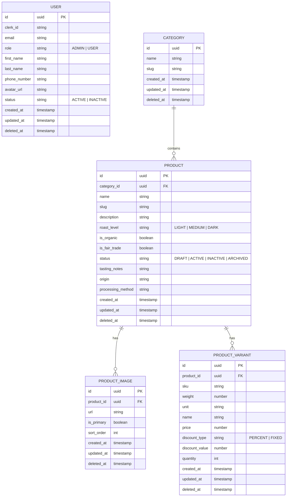

# Coffee Shop API

A NestJS backend for a coffee shop ordering system — Clerk-authenticated users, role-based
access (Admin/User), and catalog management (categories, products, variants, images) backed by
PostgreSQL via MikroORM.

## Tech Stack

| Layer               | Choice                          |
| -------------------- | -------------------------------- |
| Runtime               | [Node.js](https://nodejs.org) v24 |
| Language              | [TypeScript](https://www.typescriptlang.org) v5 |
| Framework             | [NestJS](https://nestjs.com) v11 |
| Authentication        | [Clerk](https://clerk.com) v2   |
| Database              | [PostgreSQL](https://www.postgresql.org) v18 |
| ORM                    | [MikroORM](https://mikro-orm.io) v6 |
| Unit testing           | [Jest](https://jestjs.io) v30   |
| E2E testing            | [Supertest](https://github.com/ladjs/supertest) v7 |
| API documentation      | [Swagger / OpenAPI](https://swagger.io)|
| Containerization       | [Docker](https://www.docker.com) + [Docker Compose](https://docs.docker.com/compose/) |

## Features

### Auth & Authorization

- **Authentication** — Clerk is the source of truth for identity (client uses Clerk's prebuilt
  Sign In/Up components); the API verifies Clerk-issued session tokens on protected routes.
- **User sync** — Clerk webhooks (`user.created` / `user.updated` / `user.deleted`,
  signature-verified, idempotent) keep PostgreSQL in sync with Clerk.
- **Authorization** — role-based access control with two roles: **Admin** (manager, full CRUD on
  users/categories/products) and **User** (barista, read-only).

### Catalog Management

- **User management** — CRUD with search by name/email, status filter, and pagination.
- **Category management** — CRUD, search by name.
- **Product management** — CRUD with multiple images per product (client uploads to ImgBB, backend
  only stores/validates the resulting URL) and one or more variants per product; filter by
  category, status, roast level (one or more), and price range (matches if any variant falls in
  range), search by name/slug, sort by name or price (each product's minimum variant price),
  pagination; soft-delete to preserve references from historical orders.

### Cross-cutting

- Environment validation at startup
- CORS allow-list
- Helmet security headers
- Rate limiting
- Consistent HTTP error responses
- Swagger-documented API

## Project Structure

```
src/
  common/                   cross-cutting, reusable across ≥2 modules
    entities/               shared base entities (BaseEntity: id/createdAt/updatedAt/deletedAt)
    enums/                  shared enums (UserRole, UserStatus, ...)
    constants/              non-secret default values (DEFAULT_PORT, ...) and ERROR_MESSAGES
    guards/                 HTTP guards (AuthGuard, RolesGuard)
    decorators/             param/route decorators (AuthUser, Roles)
    middlewares/            ClerkAuthMiddleware, UserResolutionMiddleware
    providers/              ClerkAuthProvider
    interceptors/           TransformResponseInterceptor (wraps controller results in { data })
    dto/                    shared request DTOs (PaginationQueryDto)
    interfaces/             shared TS interfaces (pagination result shapes)
    utils/                  small pure helpers (e.g. slug derivation)
  configs/                  env validation, mikro-orm.config.ts, cors/rate-limit config
  modules/<feature>/        feature modules (user, category, product, product-image,
                            product-variant, webhook all implemented)
    controllers/            HTTP layer
    services/               business logic, depends on the repository port (not MikroORM directly)
    repositories/           repository interface (port) + MikroORM adapter (the only MikroORM import)
    entities/               MikroORM entity for this feature
    dto/                    class-validator request/response shapes
    <feature>.module.ts     wires entity, repository, service, controller
  migrations/               MikroORM migrations (mikro-orm migration:create/up/down)
  app.module.ts             composition root
  main.ts                   bootstrap: Helmet, CORS, global ValidationPipe, listen
test/
  app.e2e-spec.ts           e2e smoke test for AppController
  user.e2e-spec.ts          e2e coverage for /users
  category.e2e-spec.ts      e2e coverage for /categories
  product.e2e-spec.ts       e2e coverage for /products
  webhook.e2e-spec.ts       e2e coverage for /webhooks/clerk
```


## ENTITY RELATIONSHIP DIAGRAM(ERD)



---

## API ENDPOINTS

> Base path: `/api/v1` - API docs `/api/api-docs`.
>
> **Auth:** 🔓 Public · 🔒 Authenticated (Clerk session token) · 👑 Admin

### Users

| Method   | Path         | Auth | Description                    |
| :------- | :----------- | :--- | :----------------------------- |
| `GET`    | `/me`        | 🔒   | Get authenticated user profile |
| `GET`    | `/users`     | 👑   | List all users                 |
| `GET`    | `/users/:id` | 👑   | Get user by ID                 |
| `POST`   | `/users`     | 👑   | Create user                    |
| `PATCH`  | `/users/:id` | 👑   | Update user                    |
| `DELETE` | `/users/:id` | 👑   | Soft-delete user               |

### Categories

| Method   | Path              | Auth | Description          |
| :------- | :---------------- | :--- | :------------------- |
| `GET`    | `/categories`     | 🔓   | List categories      |
| `GET`    | `/categories/:id` | 🔓   | Get category by ID   |
| `POST`   | `/categories`     | 👑   | Create category      |
| `PATCH`  | `/categories/:id` | 👑   | Update category      |
| `DELETE` | `/categories/:id` | 👑   | Soft-delete category |

### Products

| Method   | Path            | Auth | Description                                                    |
| :------- | :-------------- | :--- | :------------------------------------------------------------- |
| `GET`    | `/products`     | 🔓   | List products (filter by category/status/roastLevel/price range, sort by name/price, search, pagination) |
| `GET`    | `/products/:id` | 🔓   | Get product by ID                                              |
| `POST`   | `/products`     | 👑   | Create product                                                 |
| `PATCH`  | `/products/:id` | 👑   | Update product                                                 |
| `DELETE` | `/products/:id` | 👑   | Soft-delete product                                            |


## Getting Started

### Prerequisites

- Node.js v24
- pnpm (version pinned via `corepack`, see `Dockerfile`)
- Docker + Docker Compose (for running PostgreSQL, or the whole stack, in containers)
- A [Clerk](https://clerk.com) application (publishable key, secret key, webhook signing secret)

### Installation

```bash
git clone -b feat/coffee-shop-api git@gitlab.asoft-python.com:tien.nguyen/nestjs-training.git
cd nestjs-training/coffee-shop-api

pnpm install

cp .env.example .env   # then fill in real values

docker compose up -d postgres   # start PostgreSQL only, app runs on the host

pnpm run migration:up

pnpm run start:dev
```

### Environment Variables

`.env.example` lists every variable (copy it to `.env`, and to `.env.docker` if running the app
itself inside Docker) and fill in real values. All variables below are validated at startup
(`src/configs/env.validation.ts`) — the app refuses to boot if any required one is missing.

| Variable                | Description                                      |
| ------------------------ | ------------------------------------------------- |
| `NODE_ENV`                | `development` \| `test` \| `production`          |
| `PORT`                     | HTTP port the API listens on                     |
| `DB_HOST`                  | PostgreSQL host                                  |
| `DB_PORT`                  | PostgreSQL port                                  |
| `DB_NAME`                  | PostgreSQL database name                         |
| `DB_USER`                  | PostgreSQL user                                  |
| `DB_PASSWORD`              | PostgreSQL password                              |
| `CORS_ORIGIN`              | Allow-listed origin(s) for CORS                  |
| `THROTTLE_TTL`             | Rate-limit window, in milliseconds               |
| `THROTTLE_LIMIT`           | Max requests per IP per `THROTTLE_TTL` window    |
| `CLERK_SECRET_KEY`         | Clerk backend secret key                         |
| `CLERK_PUBLISHABLE_KEY`    | Clerk publishable key                            |
| `CLERK_WEBHOOK_SECRET`     | Clerk webhook signing secret                 |

### Running Locally

```bash
pnpm run start          # run
pnpm run start:dev      # watch mode
pnpm run start:prod     # run compiled dist/main.js
```

### Running with Docker

`docker-compose.yml` is the production-ready default (app + PostgreSQL, `restart: unless-stopped`,
healthchecks); `docker-compose.dev.yml` layers dev-only overrides on top (hot-reload volume mount,
Postgres port exposed to the host, no auto-restart).

```bash
pnpm run docker:dev        # dev: docker compose --env-file .env.docker -f docker-compose.yml -f docker-compose.dev.yml up --build
pnpm run docker:dev:down

pnpm run docker:prod       # prod: docker compose --env-file .env.docker -f docker-compose.yml up -d --build
pnpm run docker:prod:down
```

## Database & Migrations

MikroORM config is centralized in `src/configs/mikro-orm.config.ts` and entity paths are
auto-discovered via glob (`src/**/*.entity.ts`) — no manual entity registration needed. Schema
changes are managed exclusively through migrations; automatic schema synchronization is never used
in production.

```bash
pnpm run migration:create   # generate a new migration from entity changes
pnpm run migration:up       # apply pending migrations
pnpm run migration:down     # revert the last migration
```

## Testing

```bash
pnpm run test          # unit tests
pnpm run test:watch
pnpm run test:cov
pnpm run test:e2e      # e2e tests (requires a reachable PostgreSQL — e.g. `pnpm run docker:dev`)
```

`test:e2e` boots the full app, so it needs its own database, separate from the one `start:dev`
uses — otherwise e2e runs would create/soft-delete real-looking rows in your dev database.
`test/setup-env.js` (wired in via `test/jest-e2e.json`'s `setupFiles`) loads `.env.test` before
any application module is imported, so by the time `src/configs/mikro-orm.config.ts`'s own
`dotenv/config` runs, the DB/Clerk variables are already set and it's a no-op for those keys
(`dotenv` never overrides an already-set variable) — `src/` itself stays unaware that a "test env"
concept even exists. Create your own local `.env.test` (not committed — same shape as `.env`) with
a distinct `DB_NAME` and placeholder Clerk keys — Clerk calls made during e2e (e.g. the webhook
module's role-sync) are expected to fail against these placeholders; the code already logs and
swallows that failure. Create and migrate the test database once before running e2e locally:

```bash
createdb coffee_shop_test        # one-time, matches your .env.test's DB_NAME
set -a && source .env.test && set +a && pnpm run migration:up
```
