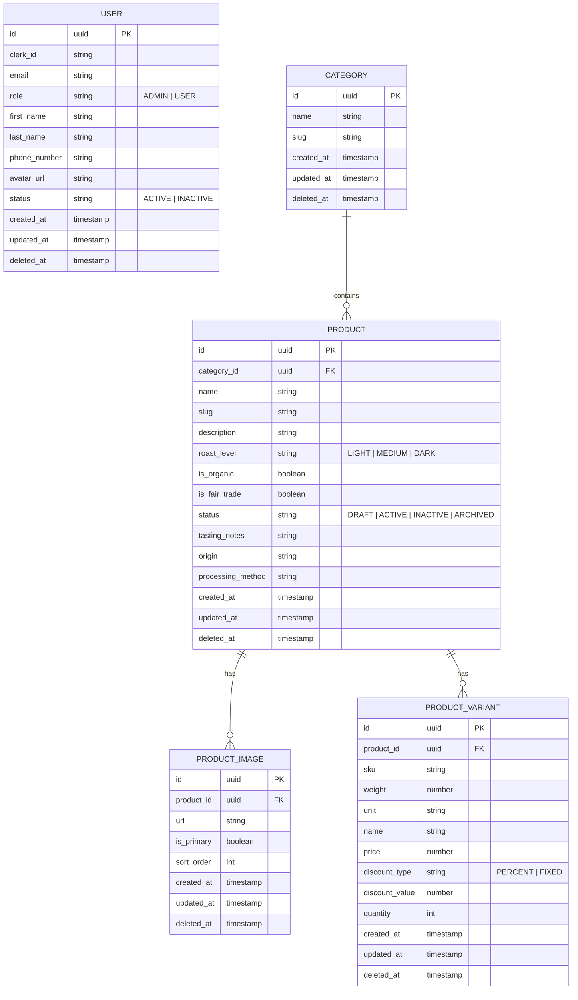

# Coffee Shop API

A NestJS backend for a coffee shop catalog — Clerk-authenticated users, role-based
access (Admin/User), and catalog management (categories, products, variants, images) backed by
PostgreSQL via MikroORM.

**Live:** [Website](https://nestjs-training-weld.vercel.app/) ·
[API Swagger](https://nestjs-training-develop.onrender.com/api/docs)

## Tech Stack

| Layer             | Choice                                                                                               |
| ----------------- | ---------------------------------------------------------------------------------------------------- |
| Runtime           | [Node.js](https://nodejs.org) v24 (ESM)                                                              |
| Language          | [TypeScript](https://www.typescriptlang.org) v6                                                      |
| Framework         | [NestJS](https://nestjs.com) v12                                                                     |
| Authentication    | [Clerk](https://clerk.com) (`@clerk/express` v2) + [Svix](https://www.svix.com) webhook verification |
| Database          | [PostgreSQL](https://www.postgresql.org) v18                                                         |
| ORM               | [MikroORM](https://mikro-orm.io) v7                                                                  |
| Validation        | [Zod](https://zod.dev) v4 (request schemas) + class-validator (env)                                  |
| Unit testing      | [Vitest](https://vitest.dev) v5                                                                      |
| E2E testing       | [Vitest](https://vitest.dev) v5 + [Supertest](https://github.com/ladjs/supertest) v7                 |
| API documentation | [Swagger / OpenAPI](https://swagger.io)                                                              |
| Observability     | [`@nestjs/observe`](https://www.npmjs.com/package/@nestjs/observe) (non-production only)             |
| Containerization  | [Docker](https://www.docker.com) + [Docker Compose](https://docs.docker.com/compose/)                |

## Features

### Auth & Authorization

- **Authentication** — Clerk is the source of truth for identity (client uses Clerk's prebuilt
  Sign In/Up components); the API verifies Clerk-issued session tokens on protected routes.
- **User sync** — Clerk webhooks (`user.created` / `user.updated` / `user.deleted`,
  signature-verified, idempotent) keep PostgreSQL in sync with Clerk.
- **Authorization** — role-based access control with two roles: **Admin** (manager, full CRUD on
  users/categories/products) and **User** (barista, read-only: own profile via `/users/me`;
  catalog reads are public). Admin `role`/`status` changes are pushed to Clerk first and written
  back to PostgreSQL by the `user.updated` webhook.

### Catalog Management

- **User management** — CRUD with search by email/first name/last name, role filter, and
  pagination; the list excludes the requesting admin.
- **Category management** — CRUD, unique name with auto-generated slug, search by name/slug.
- **Product management** — CRUD with up to 6 images per product, at most 1 primary (client
  uploads to ImgBB, backend only stores/validates the resulting URL), managed on update via
  `removeImageIds` / `updateImages` / `addImages`; one or more variants per product (SKU,
  weight + unit, price, optional discount, `quantity`); filter by category, status, roast level
  (one or more), and price range (matches if any variant falls in range), search by name/slug,
  sort by name or price (each product's minimum variant price), pagination.
- **Soft delete** — every entity has `deletedAt`; deleted rows are hidden by default and visible
  to active admins. Deleting a product sets it to `ARCHIVED`; deleting a user sets it to `INACTIVE`.

### Cross-cutting

- Environment validation at startup
- CORS allow-list
- Helmet security headers
- Rate limiting
- Consistent HTTP responses (`{ data }` / `{ data, meta }`) and errors
  (`{ statusCode, message, errors[] }`)
- Zod request validation with field-level error details (e.g. `variants.0.weight`)
- Swagger-documented API (disabled when `NODE_ENV=production`)

## Project Structure

```
src/
  common/                   cross-cutting, reusable across ≥2 modules
    entities/               shared base entities (BaseEntity: id/createdAt/updatedAt/deletedAt)
    enums/                  shared enums (UserRole, UserStatus, ...)
    constants/              non-secret default values (DEFAULT_PORT, ...) and ERROR_MESSAGES
    guards/                 HTTP guards (AuthGuard, RolesGuard)
    decorators/             AdminOnly, AuthUser, Roles, Swagger response decorators
    middlewares/            ClerkAuthMiddleware, UserResolutionMiddleware
    providers/              AuthProvider (abstract) + ClerkAuthProvider
    interceptors/           TransformResponseInterceptor (wraps controller results in { data })
    filters/                GlobalExceptionFilter (uniform error body)
    exceptions/             DomainException subclasses (validation, not found, duplicate, ...)
    repositories/           BaseRepository (the only MikroORM-aware layer: find, paginate, soft delete)
    dto/                    shared schemas/DTOs (pagination, id param, error shape)
    interfaces/             shared TS interfaces (repository options)
    utils/                  small pure helpers (slug, pagination, validation-error mapping)
  configs/                  env validation, mikro-orm, cors, rate-limit, swagger, validation-pipe,
                            observe config
  modules/<feature>/        feature modules (user, category, product, product-image,
                            product-variant, webhook all implemented)
    controllers/            HTTP layer (product-image/product-variant are managed via product)
    services/               business logic, depends on the feature repository
    repositories/           extends BaseRepository with feature queries
    entities/               MikroORM entity for this feature
    dto/                    Zod request schemas (*.schema.ts) + response DTOs
    <feature>.module.ts     wires entity, repository, service, controller
  migrations/               MikroORM migrations (mikro-orm migration:create/up/down)
  app.module.ts             composition root: global guard, interceptor, filter, pipes, middlewares
  main.ts                   bootstrap: Helmet, CORS, /api prefix, URI versioning, Swagger, listen
test/
  e2e/                      e2e specs: category, product, user, webhook, global exception filter
  utils/                    test app bootstrap + API path helpers
  setup-env.ts              loads .env.test before any app module is imported
  reset-test-db.ts          truncates the test database before each e2e run
```

## ENTITY RELATIONSHIP DIAGRAM(ERD)


```mermaid
erDiagram
    USER {
        id uuid PK
        clerk_id string
        email string
        role string "ADMIN | USER"
        first_name string
        last_name string
        phone_number string
        avatar_url string
        status string "ACTIVE | INACTIVE"
        created_at timestamp
        updated_at timestamp
        deleted_at timestamp
    }

    CATEGORY {
        id uuid PK
        name string
        slug string
        created_at timestamp
        updated_at timestamp
        deleted_at timestamp
    }

    PRODUCT {
        id uuid PK
        category_id uuid FK
        name string
        slug string
        description string
        roast_level string "LIGHT | MEDIUM | DARK"
        is_organic boolean
        is_fair_trade boolean
        status string "DRAFT | ACTIVE | INACTIVE | ARCHIVED"
        tasting_notes string
        origin string
        processing_method string
        created_at timestamp
        updated_at timestamp
        deleted_at timestamp
    }

    PRODUCT_IMAGE {
        id uuid PK
        product_id uuid FK
        url string
        is_primary boolean
        sort_order int
        created_at timestamp
        updated_at timestamp
        deleted_at timestamp
    }

    PRODUCT_VARIANT {
        id uuid PK
        product_id uuid FK
        sku string
        weight number
        unit string
        name string
        price number
        discount_type string "PERCENT | FIXED"
        discount_value number
        quantity int
        created_at timestamp
        updated_at timestamp
        deleted_at timestamp
    }

    CATEGORY ||--o{ PRODUCT : "contains"
    PRODUCT ||--o{ PRODUCT_IMAGE : "has"
    PRODUCT ||--o{ PRODUCT_VARIANT : "has"
```

---

## API ENDPOINTS

> Base path: `/api/v1` - API docs `/api/docs` (non-production only).
>
> **Auth:** 🔓 Public · 🔒 Authenticated (Clerk session token) · 👑 Admin

### Users

| Method   | Path         | Auth | Description                                  |
| :------- | :----------- | :--- | :------------------------------------------- |
| `GET`    | `/users/me`  | 🔒   | Get authenticated user profile               |
| `GET`    | `/users`     | 👑   | List users (search, role filter, pagination) |
| `GET`    | `/users/:id` | 👑   | Get user by ID                               |
| `POST`   | `/users`     | 👑   | Create user                                  |
| `PATCH`  | `/users/:id` | 👑   | Update user                                  |
| `DELETE` | `/users/:id` | 👑   | Soft-delete user                             |

### Categories

| Method   | Path              | Auth | Description          |
| :------- | :---------------- | :--- | :------------------- |
| `GET`    | `/categories`     | 🔓   | List categories      |
| `GET`    | `/categories/:id` | 🔓   | Get category by ID   |
| `POST`   | `/categories`     | 👑   | Create category      |
| `PATCH`  | `/categories/:id` | 👑   | Update category      |
| `DELETE` | `/categories/:id` | 👑   | Soft-delete category |

### Products

| Method   | Path            | Auth | Description                                                                                              |
| :------- | :-------------- | :--- | :------------------------------------------------------------------------------------------------------- |
| `GET`    | `/products`     | 🔓   | List products (filter by category/status/roastLevel/price range, sort by name/price, search, pagination) |
| `GET`    | `/products/:id` | 🔓   | Get product by ID                                                                                        |
| `POST`   | `/products`     | 👑   | Create product (optionally with images and variants)                                                     |
| `PATCH`  | `/products/:id` | 👑   | Update product (add/update/remove images)                                                                |
| `DELETE` | `/products/:id` | 👑   | Archive + soft-delete product                                                                            |

### Webhooks

Not under `/api/v1` and excluded from Swagger.

| Method | Path              | Auth           | Description                                                      |
| :----- | :---------------- | :------------- | :--------------------------------------------------------------- |
| `POST` | `/webhooks/clerk` | Svix signature | Sync `user.created` / `user.updated` / `user.deleted` from Clerk |

## Getting Started

### Prerequisites

- Node.js v24
- pnpm (version pinned via `corepack`, see `Dockerfile`)
- Docker + Docker Compose (for running PostgreSQL, or the whole stack, in containers)
- A [Clerk](https://clerk.com) application (publishable key, secret key, webhook signing secret)

### Installation

```bash
git clone -b feat/coffee-shop-api git@gitlab.asoft-python.com:tien.nguyen/nestjs-training.git
cd nestjs-training/coffee-shop-api

pnpm install

cp .env.example .env   # then fill in real values

# start PostgreSQL only (dev override exposes its port), app runs on the host
docker compose --env-file .env -f docker-compose.yml -f docker-compose.dev.yml up -d postgres

pnpm run migration:up

pnpm run start:dev
```

### Environment Variables

`.env.example` lists every variable (copy it to `.env`, and to `.env.docker` if running the app
itself inside Docker) and fill in real values. All variables below are validated at startup
(`src/configs/env.validation.ts`) — the app refuses to boot if any required one is missing.

| Variable                | Description                                   |
| ----------------------- | --------------------------------------------- |
| `NODE_ENV`              | `development` \| `test` \| `production`       |
| `PORT`                  | HTTP port the API listens on                  |
| `DB_HOST`               | PostgreSQL host                               |
| `DB_PORT`               | PostgreSQL port                               |
| `DB_NAME`               | PostgreSQL database name                      |
| `DB_USER`               | PostgreSQL user                               |
| `DB_PASSWORD`           | PostgreSQL password                           |
| `CORS_ORIGIN`           | Allow-listed origin(s) for CORS               |
| `THROTTLE_TTL`          | Rate-limit window, in milliseconds            |
| `THROTTLE_LIMIT`        | Max requests per IP per `THROTTLE_TTL` window |
| `CLERK_SECRET_KEY`      | Clerk backend secret key                      |
| `CLERK_PUBLISHABLE_KEY` | Clerk publishable key                         |
| `CLERK_WEBHOOK_SECRET`  | Clerk webhook signing secret                  |
| `APP_KEY`               | Nest Observe app key                          |
| `APP_SECRET`            | Nest Observe app secret                       |

### Running Locally

```bash
pnpm run start          # run
pnpm run start:dev      # watch mode
pnpm run start:prod     # run compiled dist/main.js
```

### Running with Docker

`docker-compose.yml` is the production-ready default (app + PostgreSQL, `restart: unless-stopped`,
healthchecks); `docker-compose.dev.yml` layers dev-only overrides on top (hot-reload volume mount,
Postgres port exposed to the host, no auto-restart).

```bash
pnpm run docker:dev        # dev: docker compose --env-file .env.docker -f docker-compose.yml -f docker-compose.dev.yml up --build
pnpm run docker:dev:down

pnpm run docker:prod       # prod: docker compose --env-file .env.docker -f docker-compose.yml up -d --build
pnpm run docker:prod:down
```

## Database & Migrations

MikroORM config is centralized in `src/configs/mikro-orm.config.ts` and entity paths are
auto-discovered via glob (`src/**/*.entity.ts`, `dist/**/*.entity.js` when compiled) — no manual
entity registration needed. Schema changes are managed exclusively through migrations; automatic
schema synchronization is never used in production.

```bash
pnpm run migration:create   # generate a new migration from entity changes
pnpm run migration:up       # apply pending migrations
pnpm run migration:down     # revert the last migration
pnpm run seeder:create      # scaffold a seeder in src/seeders
pnpm run seeder:run         # run seeders
```

## Testing

```bash
pnpm run test          # unit tests (Vitest, *.spec.ts next to the source)
pnpm run test:watch
pnpm run test:cov
pnpm run test:e2e      # e2e tests (requires a reachable PostgreSQL — e.g. `pnpm run docker:dev`)
```

`test:e2e` boots the full app, so it needs its own database, separate from the one `start:dev`
uses — otherwise e2e runs would create/soft-delete real-looking rows in your dev database.
Its `pretest:e2e` hook (`test/reset-test-db.ts`) truncates every table in that database except
the migrations table before each run.
`test/setup-env.ts` (wired in via `vitest.config.e2e.ts`'s `setupFiles`) loads `.env.test` before
any application module is imported, so by the time `src/configs/mikro-orm.config.ts`'s own
`dotenv/config` runs, the DB/Clerk variables are already set and it's a no-op for those keys
(`dotenv` never overrides an already-set variable) — `src/` itself stays unaware that a "test env"
concept even exists. Create your own local `.env.test` (not committed — same shape as `.env`) with
a distinct `DB_NAME` and placeholder Clerk keys — Clerk calls made during e2e (e.g. the webhook
module's role-sync) are expected to fail against these placeholders; the code already logs and
swallows that failure. Create and migrate the test database once before running e2e locally:

```bash
createdb coffee_shop_test        # one-time, matches your .env.test's DB_NAME
set -a && source .env.test && set +a && pnpm run migration:up
```
